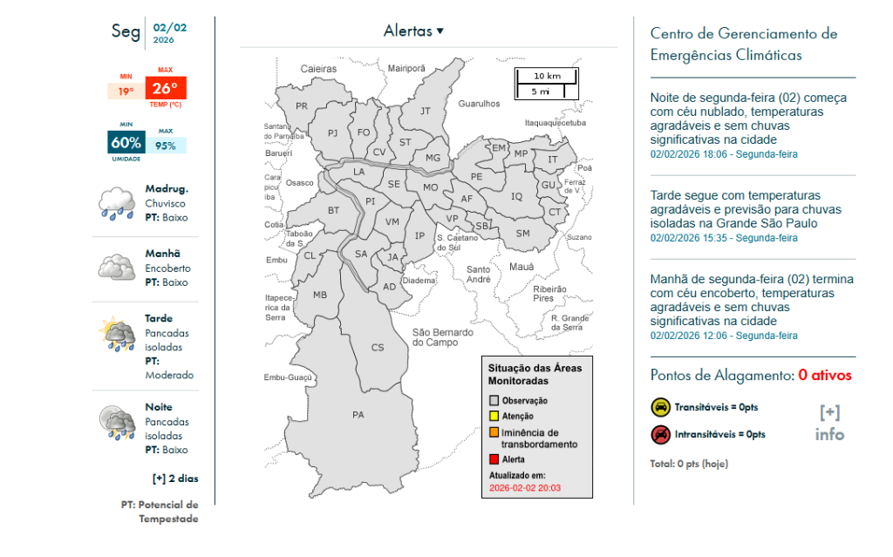
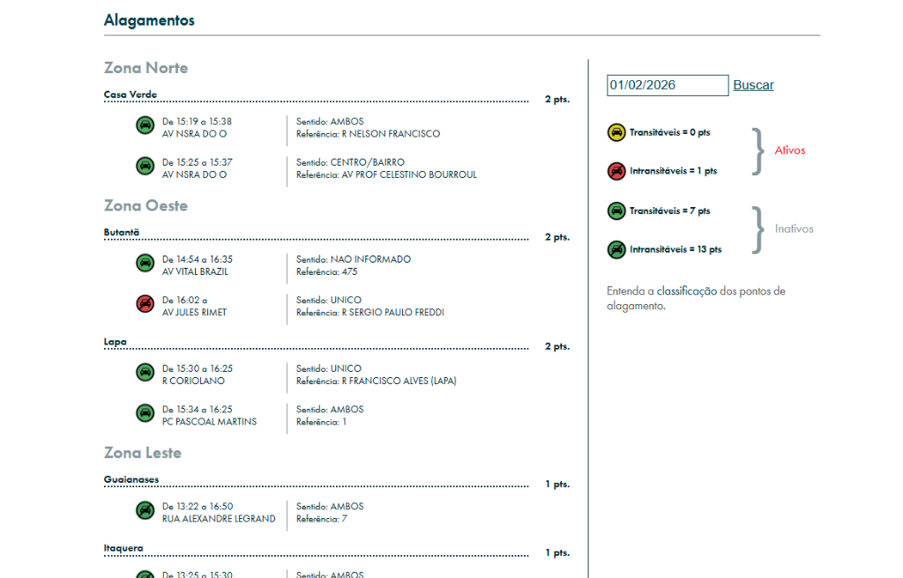

# CGESP-API

[](https://hub.docker.com/r/murilonerdx/cgesp-api)

Complete application for monitoring, analyzing, and alerting about flood events in São Paulo, based on data from CGE-SP. The system offers proactive monitoring with personalized alerts by region and street.

> 🇧🇷 **[Leia em Português](#-versão-em-português)**


## 📊 Data Source (Official CGE Site)

The data is scraped directly from the official CGE-SP website.
Below are screenshots of the original interface for comparison:





## 💻 Application Interface

Here is the actual application running:

### Frontend (Dashboard)

*Real-time monitoring dashboard with weather, notifications and search.*


### Backend (API)
```json
{
  "weather": {
    "summary": "Tarde segue com temperaturas agradáveis e previsão para chuvas isoladas na Grande São Paulo",
    "temperature": "26°C",
    "humidity": "60%",
    "condition": "Pancadas isoladas"
  },
  "floods": [],
  "news": [
    {
      "title": "Noite de segunda-feira (02) começa com céu nublado...",
      "link": "https://www.cgesp.org/v3/noticia.jsp?id=..."
    }
  ]
}
```
*Exemplo de resposta da API (/api/cge/data).*

## 📦 Architecture

The project is divided into two main modules:

- **[Backend](./backend/README.md)**: NestJS API responsible for extracting data from CGE (Scraping), processing business rules, and managing users.
- **[Frontend](./frontend/README.md)**: Modern Next.js interface for data visualization and account management.

## 🚀 Getting Started (Quickly)

### 1. Clone and Configure
Ensure you configure the `.env` files in the `backend` and `frontend` folders as described in their respective READMEs.

### 2. Run with Docker (Backend)

You can run the backend isolated via Docker for easier deployment.

#### Pull from Docker Hub
```bash
docker pull murilonerdx/cgesp-api
```

#### Run the Container
```bash
docker run -d -p 3000:3000 --env-file .env murilonerdx/cgesp-api
```

### 3. Run Locally (Development)

Open two terminals:

**Terminal 1 (Backend):**
```bash
cd backend
npm run start:dev
```

**Terminal 2 (Frontend):**
```bash
cd frontend
npm run dev
```

Access the system at `http://localhost:3001`.

---

## 🇧🇷 Versão em Português

Aplicação completa para monitoramento, análise e alerta de alagamentos em São Paulo, baseada nos dados do CGE-SP. O sistema oferece monitoramento proativo com alertas personalizados por região e rua.


### 📊 Fonte de Dados (Site Oficial CGE)

Os dados são extraídos diretamente do site oficial do CGE-SP.
Abaixo estão prints da interface original para comparação:


### 💻 Interface da Aplicação

Aqui está a aplicação rodando atualmente:

#### Frontend (Dashboard)

*Painel de monitoramento em tempo real com clima, notificações e busca.*


#### Backend (API)
```json
{
  "weather": {
    "summary": "Tarde segue com temperaturas agradáveis e previsão para chuvas isoladas na Grande São Paulo",
    "temperature": "26°C",
    "humidity": "60%",
    "condition": "Pancadas isoladas"
  },
  "floods": [],
  "news": [
    {
      "title": "Noite de segunda-feira (02) começa com céu nublado...",
      "link": "https://www.cgesp.org/v3/noticia.jsp?id=..."
    }
  ]
}
```
*Exemplo de resposta da API (/api/cge/data).*

### 📦 Arquitetura

O projeto é dividido em dois módulos principais:

- **[Backend](./backend/README.md)**: API NestJS responsável por extrair dados do CGE (Scraping), processar regras de negócio e gerenciar usuários.
- **[Frontend](./frontend/README.md)**: Interface Next.js moderna para visualização de dados e gestão de conta.

### 🚀 Como Iniciar (Rápido)

#### 1. Clonar e Configurar
Certifique-se de configurar os arquivos `.env` nas pastas `backend` e `frontend` conforme descrito em seus respectivos READMEs.

#### 2. Rodar com Docker (Backend)

Você pode rodar o backend isolado via Docker para facilitar o deployment.

**Baixar do Docker Hub**
```bash
docker pull murilonerdx/cgesp-api
```

**Rodar o Container**
```bash
docker run -d -p 3000:3000 --env-file .env murilonerdx/cgesp-api
```

#### 3. Rodar Localmente (Desenvolvimento)

Abra dois terminais:

**Terminal 1 (Backend):**
```bash
cd backend
npm run start:dev
```

**Terminal 2 (Frontend):**
```bash
cd frontend
npm run dev
```

Acesse o sistema em `http://localhost:3001`.

### 4. Deploy no Docker Hub

Para subir a imagem do backend para o seu Docker Hub:

1. Faça login:
```bash
docker login
```

2. Crie uma tag com seu usuário:
```bash
docker tag scrap-chuva-backend murilonerdx/cgesp-api
```

3. Suba a imagem:
```bash
docker push murilonerdx/cgesp-api
```
